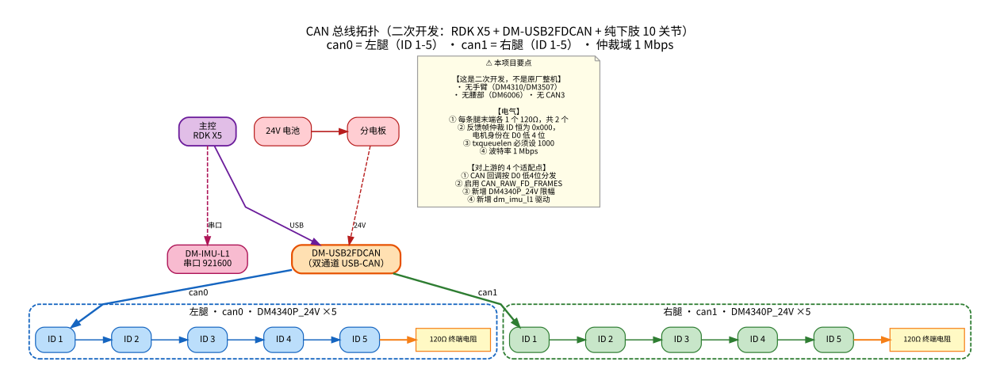

# 阶段 1 · 通信打通

> **目标：能读到电机反馈，能发指令让它动，并且你能解释每一个字节的含义。**
> 这是你和硬件之间的唯一通道。它不通，后面全是空谈。

---

## 为什么这一步比想象中难

**因为大部分失败是静默的。**

| 典型症状 | 你以为 | 实际 |
|---|---|---|
| 发指令没反应，也不报错 | "电机坏了" | 总线类型不对 |
| 读不到任何数据 | "驱动没装好" | 反馈帧 ID 认错了 |
| 读数不对但能通信 | "电机坏了" | 量程配置和代码不一致 |
| 速度读数乱跳 | "传感器坏了" | 静止时该字段物理上无意义 |

> **⇒ 这一步的真正任务，是把「静默失败」变成「可见的失败」。**

---

## 一、物理层：CAN 总线

> ⚠️ **本项目是二次开发** —— 基于 `Roboparty/roboparty_deploy @ a8a0f15`，
> 硬件是 **RDK X5 + DM-USB2FDCAN + 纯下肢 10 关节**（**无手臂、无腰部、无 CAN3**）。
> 与上游整机的差异见 [CAN 接线速查](../assets/CAN接线速查.md)。

> 📷 **拓扑图**：
>
> 详细的接线表（电机 ID 映射 / **终端电阻** / 供电拓扑 / **对上游的 4 个适配点**）
> 见 **[CAN 接线速查](../assets/CAN接线速查.md)**。
>
> ⚠️ **尤其是终端电阻** —— 每条腿末端各 1 个 120Ω，共 2 个。
> **它是 CAN 故障的头号原因，而早期文档完全没提。**


### 1.1 前置配置

**总线必须显式 UP 并设波特率。** 驱动**不会**帮你做这件事（它只做 `ioctl` 取 ifindex）。

```bash
# 手动（调试用）
sudo ip link set can0 up type can bitrate 1000000
sudo ip link set can0 txqueuelen 1000

# 验证
ip -details link show can0 | grep -E "state|bitrate|qlen"
```

**⚠️ 两个容易漏的点**：

| 项 | 为什么重要 |
|---|---|
| **`txqueuelen 1000`** | 默认是 10。队列太浅时**高频率发帧会丢**，而且不报错 |
| **`bitrate` 必须与电机一致** | 不一致的表现是**完全收不到**，不是"偶尔错" |

### 1.2 自动 UP（推荐）

用 udev 规则，插上即用。【实测】`roboparty_deploy/assets/99-auto-up-devs-*.rules`：

```
SUBSYSTEM=="net", ACTION=="add", ATTRS{idVendor}=="1d50", ATTRS{idProduct}=="606f", \
  KERNELS=="1-1.2.1", KERNEL=="can*", NAME="can0", \
  RUN+="/sbin/ip link set can0 up type can bitrate 1000000", \
  RUN+="/sbin/ip link set can0 txqueuelen 1000"
```

```bash
sudo cp assets/99-auto-up-devs-sunrise.rules /etc/udev/rules.d/   # RDK X5
sudo udevadm control --reload && sudo udevadm trigger
# 重插 USB-CAN，然后 ip a 检查
```

### 1.3 ⚠️ 一个反直觉的兼容性坑【实测】

**达妙固件把所有帧都标成 CAN FD 帧**（`gs_usb` flags 带 FD 位），
**内核只把 `canfd_frame` 投递给启用了 `CAN_RAW_FD_FRAMES` 的 socket。**

```
不启用 CAN_RAW_FD_FRAMES 的表现：
  TX 完全正常、零报错
  RX 全静默 ← 这是最恶心的部分
```

**⇒ 所以：即使走经典 CAN，代码里也必须强制开这个选项。**

【实测】`roboparty_deploy/src/motors/src/protocol/can/socket_can.cpp:52-59` 就是干这个的：

```cpp
// DM-USB2FDCAN 模块固件把所有帧都标成 FD 帧（gs_usb flags 带 FD 位），
// 内核只把 canfd_frame 投递给启用 CAN_RAW_FD_FRAMES 的 socket——
// 不启用则 RX 全静默（TX 正常，2026-09-04 实测排查）。
setsockopt(sockfd_, SOL_CAN_RAW, CAN_RAW_FD_FRAMES, &enable, sizeof(enable));
```

> **如果你自己从零写驱动，这一条会让你怀疑人生。**
> **症状是「发得出去、收不回来、什么都不报」。**

### 1.4 总线映射必须在物理上确认

**不要靠猜。** 用 udev 的 `KERNELS==` 绑定到**物理 USB 口**，或者插一根测一根。

**【实测】** DM10 的映射（**2026-09-17 实测裁决，覆盖 2026-09-08 的错误结论**）：

| 总线 | 部位 |
|---|---|
| **can0** | **左腿**（ID 1-5）|
| **can1** | **右腿**（ID 1-5）|

> ⚠️ **2026-09-08 曾得出相反结论**（"can2=左腿、can1=右腿，和直觉相反"）—— 那个是**错的**。
>
> ⚠️ **接口名本身也会漂**：2026-09-17 之前板载 CAN 在启动时抢占 `can0`，
> USB 适配器只能拿到 can1/can2（所以那天的实测记录写的是 can1=左 / can2=右）。
> 禁掉板载 CAN（`systemctl disable can4.service`）之后才是 can0/can1。
> **接线一根没动，只是名字整体降了一位。**
> ⇒ 脚本一律从 `robot.yaml` 的 `motor_interface` 读，别写死。

---

## 二、协议层：达妙 DM 帧格式

### 2.1 发送帧（MIT 模式，8 字节）

**仲裁 ID = 电机 ID**（如 `0x001`~`0x00A`）。

| 字节 | 位域 | 内容 | 位宽 |
|---|---|---|---|
| D0–D1 | 16 bit | 目标位置 `p_des` | 16 |
| D2 + D3[7:4] | 12 bit | 目标速度 `v_des` | 12 |
| D3[3:0] + D4 | 12 bit | 刚度 `kp` | 12 |
| D5 + D6[7:4] | 12 bit | 阻尼 `kd` | 12 |
| D6[3:0] + D7 | 12 bit | 前馈力矩 `t_ff` | 12 |

**打包代码**（【实测】`dm_motor_driver.cpp:419-426`）：

```cpp
data[0] = p >> 8;                          data[1] = p & 0xFF;
data[2] = v >> 4;                          data[3] = (v & 0x0F) << 4 | kp >> 8;
data[4] = kp & 0xFF;                       data[5] = kd >> 4;
data[6] = (kd & 0x0F) << 4 | t >> 8;       data[7] = t & 0xFF;
```

> ⚠️ **注意 kp 和 kd 是跨字节劈开的** —— 这是最容易写错的地方。

### 2.2 物理量 → 整数的映射

```cpp
p  = range_map(f_p, -PosMax, +PosMax, 0, 65535);
v  = range_map(f_v, -SpdMax, +SpdMax, 0, 4095);
kp = range_map(f_kp, 0,      OKpMax,  0, 4095);
kd = range_map(f_kd, 0,      OKdMax,  0, 4095);
t  = range_map(f_t, -TauMax, +TauMax, 0, 4095);
```

> ⚠️ **位置 0 映射到整数 0，不是中值 32767。** 这不是笔误，是 `range_map` 的实现。

### 2.3 ⭐ 反馈帧（这是最容易认错的地方）

| 字节 | 位域 | 内容 |
|---|---|---|
| **仲裁 ID** | — | ⚠️ **恒为 Master_ID = `0x000`**（不是电机 ID！）|
| D0[7:4] | 4 bit | 状态/错误码（**只记录 8~15**）|
| **D0[3:0]** | 4 bit | **电机 ID** ← **靠这 4 位认人** |
| D1–D2 | 16 bit | 实际位置 |
| D3 + D4[7:4] | 12 bit | 实际速度 |
| D4[3:0] + D5 | 12 bit | 实际**力矩** |
| D6 | 8 bit | MOS 温度 |
| D7 | 8 bit | 转子温度 |

> ⚠️ **这是 DM 协议最反直觉的地方。**
> 官方文档说反馈帧 ID 是「主站号 + 电机 ID」，
> **实测所有反馈帧的仲裁 ID 都是 `0x000`，电机身份藏在 D0 低 4 位。**
>
> **⇒ 代码必须按 `frame.data[0] & 0x0F` 做分发**（【实测】`dm_motor_driver.cpp:35-45`）。
>
> **代价**：同一条总线上**不能挂其他「按 can_id 分发」的驱动器** ——
> key extractor 是**每条总线全局唯一**的。

### 2.4 ⭐ `ERR=1` 不是错误，是「使能」

**D0 高 4 位** 的含义（手册第 13 页）：

| ERR | 含义 |
|---|---|
| **0** | **失能** |
| **1** | **使能** ← ⚠️ **不是错误！** |
| 8 / 9 / A / B / C / D / E | 超压/欠压/过流/MOS过温/线圈过温/通讯丢失/过载 |

> ⚠️ 代码里字段名叫 `err` 有误导性 —— 它是「状态」。**看到 `err=1` 别当故障。**

---

## 三、⭐ 量程必须实读，不能猜

### 3.1 为什么

**手册原文**：`p_des`、`v_des`、`t_ff` 的范围**可由调试助手进行设定**。
**⇒ 不是固定值。**

### 3.2 怎么读

**读参帧**：`0x7FF` + `D0/D1`=CANID + **`D2=0x33`** + `D3=RID`

| RID | 参数 |
|---|---|
| `0x15` | PMAX |
| `0x16` | VMAX |
| `0x17` | TMAX |
| `0x50` | 当前位置（应与反馈帧一致）|

### 3.3 ⚠️⚠️ 硬阻塞：Python 层读不到

> **【实测】`get_motor_param()` 只发请求帧，代码里没有解析回复的分支。**
>
> - `dm_motor_driver.cpp:248-286` 只发 `0x33`
> - `can_rx_cbk`（`:208-238`）**没有 0x11 回复分支**
> - `param_cmd_flag_` 被声明但从未被读
>
> **⇒ 参数值永远拿不到。**

**两条出路**：

| 路由 | 做法 |
|---|---|
| **A（推荐）** | **用达妙官方上位机**读一次，把值抄进配置 |
| **B** | 改 C++：加 `can_rx_cbk` 的 0x11 分支 + 暴露 getter |

### 3.4 验证读到的值

**【实测】本机 4 台 DM-J4340-2EC 24V 实读**（2026-09-17，达妙官方上位机 DMTool v2.1.8.4）：

```
PMAX = 12.5
VMAX = 10.0     ⚠️ 注意
TMAX = 28.0     ⚠️ 注意
```

> ⭐ **已定案（2026-09-17）**：24V 那行已从 `{12.5, 6, 12, 500, 5}` 改为 `{12.5, 10, 28, 500, 5}`。
> 交叉印证：`Imax(10.26 A) × K_T(2.61 N·m/A) = 26.8 ≈ TMAX(28)`，两条独立路径吻合。
>
> ✅ **2026-09-21 已同步到板子并重编。** 验证方式不是"编译通过"，而是直接在板子的
> `inference_node` 二进制里搜那几行浮点数：`{12.5, 10, 28, 500, 5}` 出现 1 次，
> `{12.5, 6, 12, 500, 5}` 出现 0 次。
>
> ⚠️ 板子自此跑的是新值 ⇒ **策略的 `dof_vel` 观测从 0.6× 变成 1×**。
> 下一次上机是一轮**新的**验证，与 09-17 那次三层对照的数据**不再可比**。

#### ⚠️ 2026-09-21 更正：「下行放大 2.33×」这个判断是错的

当时的推论是「下行放大 2.33×、上行低估 2.33× ⇒ kp/kd 必须重调」。**它只对 `tau_ff` 成立**，
而本项目的推理路径 `tau_ff` 与 `v_des` **恒为 0**（`apply_action` 只传位置，
`RobotInterface::apply_action` 里 `v.empty()` / `tau.empty()` 都取 0）：

| 打包项 | 用的 Max | 6/12 vs 10/28 | 实际影响 |
|---|---|---|---|
| `p` / `kp` / `kd` | `PosMax` / `OKpMax` / `OKdMax` | **两版相同** | ✅ 无 |
| `v` 速度指令 | `SpdMax` | 不同 | 恒为 0 ⇒ 两端都解成 0 ⇒ ✅ 无 |
| `t` 力矩前馈 | `TauMax` | 不同 | **恒为 0 ⇒ 两端都解成 0** ⇒ ✅ 无 |

**⇒ 下行力矩不随这个修复改变，`kp/kd` 不需要重新整定。**

#### 真正受影响的是上行，而且是**速度**不是力矩

```cpp
motor_spd_     = range_map(spd_int, 0, 4095, -limit_param_.SpdMax, SpdMax);  // 板上 6，固件 10 ⇒ 读到 0.6×
motor_current_ = range_map(t_int,   0, 4095, -limit_param_.TauMax, TauMax);  // 板上 12，固件 28 ⇒ 读到 0.43×
```

- **`motor_spd_` → `joint_vel_` → `get_dof_vel_obs` ⇒ 直接进策略观测** ⚠️
  训练侧（MuJoCo）给的是真值 ⇒ 部署时策略看到的关节速度**系统性偏小 1.67 倍**。
  **这条才是"上线前必须改掉"的真正理由** —— 不是力矩会放大，是策略的输入对不上。
- `motor_current_` → `joint_tau_` → 只进 `/joint_states` 的 effort 与 `get_joint_tau()`，**不喂控制**。

**⇒ 这一条必须在第一次上电前定案。**（已定案；剩下的是把板子同步过去。）

---

## 四、⭐ 另外三个「不报错但会出事」的坑

### 4.1 `error_id` 只增不减

【实测】`dm_motor_driver.cpp:224-229`：**只在 D0 高 4 位 > 7 时才写入**，
故障消失后**不会自动清零**。

**⇒ 判断「当前有没有错」的正确姿势**：

```
1. clear_motor_error()          # 发 FF..FB
2. 等一帧新的反馈
3. 再看 error_id 是否仍非 0
```

**直接读 `error_id` 会永远读到历史错误。**

### 4.2 同总线同 ID 只能建一个实例

**回调注册键 = 电机 ID**（`dm_motor_driver.cpp:48`），
key extractor 取 `frame.data[0] & 0x0F`（`:41-44`，**只支持 ID 1-15**）。

**⇒ 第二个同 ID 实例会静默顶掉第一个的回调** —— 第一个永远收不到反馈。

**这条是配置纪律**：**每条总线上电机 ID 必须唯一且 ≤ 15**。

### 4.3 静止时速度字段无意义

【实测】决定性实验（使能 ID4，给一个小幅目标）：

| 时刻 | pos | vel_raw | 说明 |
|---|---|---|---|
| 未动 | +1.0931 | 3854 | — |
| **运动** | +1.1088 | **1035** | ✅ 真的在动 |
| **减速** | +1.1103 | **265** | ✅ 真的在变 |
| 停住 | +1.1107 | 3854 | — |
| 停住 | +1.1107 | **0** | ⚠️ 又变了 |

**⇒ 两个结论**：
1. 位域解析是对的（运动时确实随速度变化）
2. ⚠️ **静止时 `vel_raw` 在 3855/3854/0 之间随机跳 —— 该字段在静止态不可信**

**用速度时必须先确认电机在动。**

---

## 五、IMU 侧

### 5.1 物理接口

| 项 | 值 |
|---|---|
| 设备 | DM-IMU-L1，USB CDC-ACM |
| 路径 | `/dev/ttyACM0` |
| 波特率 | **921600**（8N1）|
| 硬件输出频率 | 500 Hz（可配 100-1000）|

**权限**：`chmod 666` 或把用户加进 `dialout` 组。

### 5.2 ⭐ 实际帧型（与手册不符）

| RID | 内容 | 说明 |
|---|---|---|
| 1 | 三轴加速度 | m/s²，**含重力**（静止 z ≈ +9.8）|
| 2 | 三轴角速度 | **原生 rad/s** |
| 3 | 欧拉角 | 度 → 驱动转四元数 |
| 4 | 四元数 | ⚠️ **硬件不发这一帧** |

**三条实测与手册的冲突**：

| # | 手册说 | 实测 |
|---|---|---|
| 1 | 角速度单位 **°/s** | **原生 rad/s**（再乘 °→rad 会小 57 倍）|
| 2 | 有**四元数帧** | **只发 RID 1/2/3** |
| 3 | 有**温度帧** | **不发** —— `get_temperature()` 恒为 0（不是 bug）|

**另**：**晃动时欧拉角会输出 ±inf/nan**（驱动已加 `std::isfinite` 守卫跳过）。

### 5.3 帧格式

```
55 AA | ID | RID | DATA(12或16B) | CRC16_LE(2B) | 0A
```
- RID 1/2/3 → **19 字节**；RID 4 → 23 字节
- **ID 字节不校验**（驱动直接跳过）
- **CRC16**：poly `0x1021`，init `0xFFFF`，**更新式 `(crc << 1) ^ table[(crc >> 8) ^ byte]`**
  （⚠️ **不是标准 CCITT 的 `<<8`**，移植必须原样照搬）

---

## 六、过关判据

**跑通这三条，就算过关：**

| # | 判据 | 怎么测 |
|---|---|---|
| **1** | **能读到所有电机的反馈** | 逐个 ID 读，看 `pos` 合理、`error_id` 为 0 或 1 |
| **2** | **发一条指令，电机按预期动** | 给一个小位置目标（如 ±0.1 rad），看它动且方向对 |
| **3** | **你能解释每一个字节的含义** | 手动拆一帧，对照上面的表 |

> ⭐ **第 3 条是分水岭。**
> 如果你只能说"它会动了"，而说不出"这个字节是位置的高 8 位" ——
> **那后面出问题时你无法定位。**

---

## 七、常见症状速查

| 症状 | 最可能原因 | 去哪查 |
|---|---|---|
| 发得出去，收不回来，**不报错** | `CAN_RAW_FD_FRAMES` 没开 | [§1.3](#13--一个反直觉的兼容性坑实测) |
| 完全收不到任何数据 | 反馈帧 ID 认错（以为按 can_id 分发）| [§2.3](#23--反馈帧这是最容易认错的地方) |
| 电机不动，也不报错 | 模式没切（首次调用只切模式，不发目标）| 见下方 ⚠️ |
| 读数不对 | 量程配置与电机不一致 | [§3](#三-量程必须实读不能猜) |
| 速度读数乱跳 | 静止时该字段无意义 | [§4.3](#43-静止时速度字段无意义) |
| 一直读到同一个错误 | `error_id` 只增不减 | [§4.1](#41-error_id-只增不减) |
| 第二个电机收不到反馈 | 同总线同 ID 冲突 | [§4.2](#42-同总线同-id-只能建一个实例) |

> ⚠️ **"电机不动也不报错"** 的专属坑【实测】：
> `motor_mit_cmd` / `motor_pos_cmd` / `motor_spd_cmd` 在**模式不匹配时只切模式、当次不发目标**。
> **⇒ 脚本必须先 `set_motor_control_mode(MIT)`，再进循环发命令。**

---

## 工具

```bash
# 上电前自检（检查 CAN 是否 UP、波特率、txqueuelen）
../../scripts/check_preflight.sh

# 装 onnx 可额外校验部署侧维度（阶段 4 会用到）
pip install onnx
```
